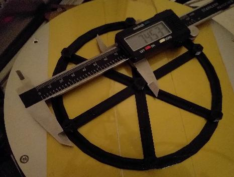

This document is currently just an outline for a future document
describing Klipper's delta calibration tool. The steps detailed in
this guide do not work on the current software!

Delta calibration involves finding the tower endstop positions, tower
angles, delta radius, and delta arm lengths. These settings control
printer motion on a delta printer. Each one of these parameters has a
non-obvious and non-linear impact to moves. It is therefore difficult
and tedious to calibrate them manually. The software calibration code
can provide excellent results with just a few minutes of time. No
special probing hardware is necessary to get good results.

Initial configuration
=====================

In order to perform delta calibration it is necessary to have initial
settings for the delta arm length and delta radius parameters. Most
delta printer kits will provide these parameters - start by
configuring the printer with them.

If the arm lengths were not provided then use a ruler to measure the
distance between the center of the eyelet to the center of the eyelet.

If the radius is not provided then one can measure the distance from
the center of the bed to the tower and then subtract from that the
"effector offset" and "carriage offset". There are guides online
describing this process.

An initial endstop position can be calculated by starting with a large
endstop position, then homing the delta printer, and then slowly Z
jogging the printer towards the bed. Use the "paper test" to determine
the point where the nozzle meets the bed. Use GET_POSITION to
determine the Z height reported at this point and then subtract this
value from the initial value chosen for the endstop position. Update
the config and issue a RESTART command.

During the delta calibration process it may be necessary for the
printer to probe below what would otherwise be considered the plane of
the bed. It is typical to permit this during calibration by updating
the config so that the printer's minimum_z_position=-5. (Once
calibration completes, one can remove this setting from the config.)

Six point delta calibration
===========================

Klipper has a DELTA_CALIBRATE command that can perform a basic "six
point" calibration. This command probes seven different points on the
bed and calculates new values for the tower angles, tower endstops,
and delta radius.

There are two ways to perform the probing - manual probing and
automatic probing. Automatic probing utilizes a hardware device
capable of triggering when the toolhead is at a set distance from the
bed. Manual probing involves using the "paper test" to determine the
height at each probe point. It is recommended to use manual probing
for delta calibration. A number of common printer kits come with
probes that are not very accurate (specifically, small differences in
arm length can cause effector tilt which can skew an automatic
probe). Manual probing only takes a few minutes and it eliminates
error introduced by the probe.  (TODO - possibly describe how to test
if the probe is accurate on a delta.)

To perform the basic probe, make sure the config has a
[delta_calibrate] section defined and run:
```
DELTA_CALIBRATE
```
After probing the seven points the delta parameters will be
updated. Then run:
```
SAVE_CONFIG
```
to save the probe results and new parameters for future sessions.
(TODO - SAVE_CONFIG isn't implemented yet.)

The basic calibration should provide sufficiently accurate delta
parameters to perform basic printing. If this is a new printer, this
is a good time to print some basic objects and verify general
functionality.

Nine point delta calibration
============================

The basic six point calibration generally does a good job of
calculating delta parameters such that the nozzle is the correct
distance from the bed. However, it does not attempt to calibrate X and
Y dimensional accuracy. It's a good idea to perform an enhanced "nine
point calibration" to also get good dimensional accuracy.

This calibration procedure requires printing a test object and
measuring parts of that test object with digital calipers.

Use a slicer to generate G-Code from the
[docs/prints/calibrate_size.stl](prints/calibrate_size.stl) file.
Slice the object using a slow speed (eg, 40mm/s). The object has a
diameter of 140mm. If this is too large for the printer then one can
scale it down (but be sure to uniformly scale both the X and Y
axes). If the printer supports significantly larger prints then this
object can also be increased in size. A larger size can improve the
measurement accuracy, but good print adhesion is more important than a
larger print size.

Print the test object and wait for it to fully cool. If possible,
perform the measurements described below while the object is still
attached to the print bed, but don't worry if the part detaches from
the bed - just try to avoid bending the object when performing the
measurements.

Start by measuring the distance between the center pillar and the
pillar next to the "A" label (which should also be pointing towards
the "A" tower).



Then go clockwise and measure the distances between the center pillar
and the other pillars (distance between center and pillar across from
B label, distance between center and pillar with C label, etc.). Enter
these parameters into Klipper with a comma separated list of floating
point numbers:
```
DELTA_ANALYZE CENTER_DISTS=<a_dist>,<far_b_dist>,<c_dist>,<far_a_dist>,<b_dist>,<far_c_dist>
```
Provide the values without spaces between them. (TODO - this command
doesn't exist yet.)

Then measure the distance between the A pillar and the pillar across
from the B label.


Then go clockwise and measure the distance between the pillar across
from B to the C pillar, the distance between the C pillar and the
pillar across from A, and so on. Enter these parameters into Klipper:
```
DELTA_ANALYZE OUTER_DISTS=<a_to_far_b>,<far_b_to_c>,<c_to_far_a>,<far_a_to_b>,<b_to_far_c>,<far_c_to_a>
```

At this point it is okay to remove the object from the bed. The final
measurements are of the pillars themselves. Measure the size of the
center pillar along the A spoke, then the B spoke, and then the C
spoke.


Enter them into Klipper:
```
DELTA_ANALYZE CENTER_PILLAR_WIDTHS=<a>,<b>,<c>
```

The final measurements are of the outer pillars. Start by measuring
the distance of the A pillar along the line from A to the pillar
across from B.


Then go clockwise and measure the remaining outer pillars (pillar
across from B along the line to C, C pillar along the line to pillar
across from A, etc.) and enter them into Klipper:
```
DELTA_ANALYZE OUTER_PILLAR_WIDTHS=<a>,<far_b>,<c>,<far_a>,<b>,<far_c>
```

The last step is to provide the scale factor that was used when
slicing the object:
```
DELTA_ANALYZE SCALE=1.0
```
(A scale value of 2.0 would mean the object is twice its original
size, 0.5 would be half its original size.) At the completion of this
command Klipper will calculate new delta parameters. Use the
SAVE_CONFIG command to apply these parameters to future sessions:
```
SAVE_CONFIG
```

If the delta printer has good dimensional accuracy then the distance
between any two pillars should be around 74mm and the width of every
pillar should be around 9mm. (Specifically, the goal is for the
distance between any two pillars minus the width of one of the pillars
to be exactly 65mm.) Should there be a dimensional inaccuracy in the
part then the above calibration routine will update the delta
parameters to try and correct it.
